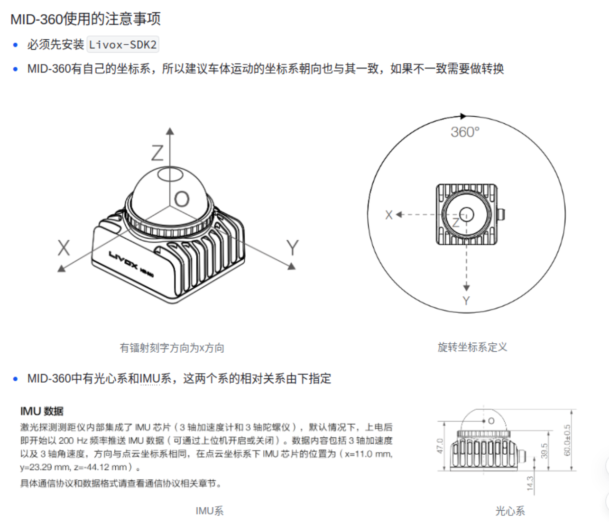

# ros2-humble-mid360

#### 介绍
本程序完成了mid360进行建图和导航的基础功能框架

#### 环境说明
ros2 版本：  **humble**


#### 使用说明
 **1、功能包说明**  
driver:  设备资源处理

    livox_ros_driver2 --- 获取mid360雷达点云
    
    serial_node --- 底盘串口通信

lio：    建图算法

    FAST_LIO --- fast_lio建图
    
    point_lio --- point_lio建图(无法使用)


mapper:  二维、三维栅格建图以及点云处理

    octomap_server2 --- 在/octomap_full、/octomap_binary上发布三维栅格图，同时在/project_map上发布二维栅格图
    
    pcd2pgm --- 用于读取点云的pcd文件，并在/map上发布二维的栅格图
    
    pointcloud_to_laserscan --- 将mid360的点云数据转换成的激光雷达数据，用于导航


navigation：导航包以及导航相关算法

    robot_navigation2 --- 使用navigation2进行导航


registration:    定位算法

    amcl_registration --- 使用amcl进行定位
    
    icp_registration  --- 使用icp进行定位


robot：  机器人模型描述

    robot --- URDF 模型(robot.urdf) + robot_state_publisher，负责发布
              /robot_description 以及 base_link -> livox_frame 这段 TF。
              nav.sh 启动时第一个拉起它，且不带 rviz（display.launch.py 的
              use_rviz 默认 false，想单独看模型用 use_rviz:=true）。
              —— 这段 TF 目前有个重复发布的已知问题，详见文末「其他」一节


 **2、编译** 

`colcon build --symlink-install --cmake-args   -DROS_EDITION=ROS2   -DHUMBLE_ROS=humble `


或者


`./build.sh`


编译 octomap_server2时会报警告，不理就行


**3、运行** 

3.1 -- 建图

- 命令：`./mapping.sh`

- 在建图前，先配置将mid360的ip配置一下，网上有教程，目录在`driver/livox_ros_driver2/config/MID360_config.json`,

- 然后再前往`lio/FAST_LIO/config/mid360.yaml`中，检查是否满足以下情况


```
pcd_save_en: true
dense_publish_en: false
map_file_path: "maps/test.pcd"
建图产物统一保存在工作空间根目录的 maps/ 下，路径由 mapping.launch.py 按工作空间位置
自动推导，搬到别的目录也不用改；上面这行只是直接用 ros2 run 启动时的兜底值。
想换文件名，改 mapping.launch.py 里拼路径那行的 test.pcd。
```

- 这里配合底盘使用，需要摁一下lcd屏幕上的按钮，将底盘切换到遥控模式，此时可以用遥控器控制车辆在室内走几圈


3.2 -- 保存地图

- **三个保存命令都要执行，缺一不可。** 它们保存的是三种不同格式的地图产物，分别供后续不同环节使用，互相不能替代：

| 命令 | 产物 | 格式 | 后续用途 |
|------|------|------|----------|
| `./save_pcd.sh` | `maps/test.pcd` | 3D 点云 | 导航时 `pcd2pgm` 与 `icp_registration` 的输入 |
| `./save_2dmap.sh` | `maps/map.pgm` + `maps/map.yaml` | 2D 栅格 | rviz / Nav2 加载的二维地图 |
| `./save_3dmap.sh` | `maps/octomap.bt` | 3D 栅格 | 三维占据栅格存档 |

- **必须都建图节点（`./mapping.sh`）运行期间执行。** 保存靠的是向运行中的节点发服务调用、
  或订阅其实时发布的话题，建图停掉后就取不到数据了。建议走完一圈建图后，按
  **pcd → 2dmap → 3dmap** 的顺序依次执行。

- 依赖：`save_3dmap.sh` 需要先装 `sudo apt install -y ros-humble-octomap-server`
  （`save_2dmap.sh` 依赖的 `nav2_map_server` 一般随 nav2 自带）。
- 命令:`./save_pcd.sh`保存pcd文件，执行的是fast_lio自带的保存方法，路径也是fast_lio的保存路径
- 命令:`./save_2dmap.sh`保存pgm文件，保存路径以及保存topic均要在该文件中修改
- 命令：`./save_3dmap.sh`保存bt或者ot文件，该命令只能保存octomap生成的三维栅格图，同样需要在命令文件中修改保存路径

3.3 -- 导航

命令：

`./nav.sh`

`nav.sh` 按固定顺序拉起 9 个 launch，**第一条是 `ros2 launch robot display.launch.py`**
（机器人模型，不带 rviz），它先把 TF 树发出来，等 2 秒再起后面 8 个节点，避免后启动的
节点一开始找不到 TF。其余 8 条顺序为：驱动 → FAST-LIO → 串口底盘 → 点云转2D扫描 →
octomap → pcd2pgm → ICP 配准 → Nav2。

所有节点后台运行，日志在 `log/nav_1.log` ~ `log/nav_9.log`，**编号就是上面的启动顺序**
（比如 `log/nav_1.log` 是机器人模型，`log/nav_8.log` 是 ICP 配准）。排查问题先看这几个日志。

`nav.sh` 开头会自动 `pkill` 上一轮的残留节点，其中 `robot_state_publisher` 和
`joint_state_publisher` 是单独列的 —— 因为 `ros2 launch` 被 SIGKILL 后子进程会变成孤儿，
光靠 `pkill -f 'ros2 launch'` 收不掉。手动清理用 `./kill_ros.sh`（先 SIGTERM 再补 SIGKILL，
`--list` 只列出不杀）。

- 执行完3.1建图后，会在工作空间的 maps/ 目录下生成 test.pcd，可以通过在当前目录打开终端执行`pcl_viewer maps/test.pcd`查看点云情况,确认点云无误后打开 mapper/pcd2pgm/config/pcd.yaml


- 每次启动都要先进行2d pose estimate，大概车在哪个位置，单击后绿色箭头指向MID-360的镭射面
- 随后可以进行nav2 goal设定目标地点 这里也可以通过箭头指向最终要朝向的方向

设置：

```
file_directory: maps/        #兜底值，pcd2pgm.launch.py 会自动填成 <工作空间>/maps/，末尾斜杠不可少
file_name: test              #文件名
thre_z_max: 0.35             #高度带上沿：离地 0.71m
thre_z_min: -0.25            #高度带下沿：离地 0.11m
```

**这两个值不是随手填的，基准也不是地面。** PCD 的 z=0 是建图起始时 FAST-LIO 的位姿原点
（IMU），地面在 z≈-0.36。用 `pcl_viewer` 或脚本量一下自己地图的地面 z，再往上加你想要的
离地高度，就是 `thre_z_min`。宁可偏高不可偏低：偏低会把地面残留切进地图，投影成一大坨实心块；
偏高只是丢掉矮障碍。详见 `pcd.yaml` 里的注释。


打开 `mapper/pointcloud_to_laserscan/launch/pointcloud_to_laserscan_launch.py`

设置：

```
'min_height': -0.29,     # 离地 0.11m，与 thre_z_min 物理高度带一致
'max_height': 0.35,      # 与thre_z_max 一致
```

`打开 driver/serial_node/launch/serial_comm.launch.py`

自行设置串口和波特率,由于学艺不精，无法做到精准定位，因此这两个可以看成倍率

```
{'linear_scale': 5000.0},     # 前后速度倍率
{'angular_scale': 500.0},   # 转向速度倍率
```




打开 `registration/icp_registration/config/icp.yaml`

设置:

```
pcd_path: "maps/test.pcd"    #兜底值，icp.launch.py 会自动填成 <工作空间>/maps/test.pcd
map_frame_id: "map"
odom_frame_id: "odom"
laser_frame_id: "base_link"
pointcloud_topic: "/livox/lidar"
yaw_offset: 6                #步数(整数！)，不是角度
yaw_resolution: 30.0         #角度(度)
```

**`yaw_offset` 和 `yaw_resolution` 不是一回事，别混：**

- `yaw_resolution` 是**角度步长**（度），代码里会转成弧度。
- `yaw_offset` 是**每个方向搜几步**（整数），它直接当循环边界用：
  `for (int k = -yaw_offset; k <= yaw_offset; k++)`，候选角度 = `起始yaw + k * yaw_resolution`。
- 所以总搜索范围 = **±(yaw_offset × yaw_resolution)**。默认 `6 × 30° = ±180°`，全向覆盖，
  候选数 = `3 × 3 × (2×6+1) = 117`（XY 各 ±`xy_offset`，默认 0.2m）。
- 嫌启动慢就减小：`6`→±180°(117 个候选)、`3`→±90°(63 个)、`1`→±30°(27 个)。
  只在第一帧做一次，慢一点可以接受。

> **踩过的坑（已修，写在这防止再犯）**：这里曾经写成 `yaw_offset: 30.0`，代码里又加了
> `* M_PI / 180.0` 把它当角度转成弧度 → 值变成 0.5236，塞进 `int k` 被截断成 0，
> 循环只跑 `k=0` 一次，**yaw 粗搜索完全失效**。后果是 `map -> odom` 的 yaw 只剩 ICP
> 从 0° 局部收敛的结果，收敛到错误局部极小值时，rviz 的 map 视图里车头就是歪的。
> 现在参数类型在代码里改成了 `int`，所以要写成**整数**（`6`），写成 `6.0` 会因参数类型
> 不符直接把节点拉不起来 —— 这是刻意的，让"步数还是角度"在类型层面无法含糊。

另外注意 `icp_registration.cpp` 里 **ICP 失败是静默回退**的（日志打 `ICP failed`，然后拿
initial_pose 当结果继续发 `map -> odom`）。所以别只看进程还活着就以为配准成功了，
启动后要确认日志里有正常的 `score:` 值。命中不了就检查 `initial_pose`（默认全 0，
它的 yaw 是**弧度**）和机器人的实际起始位置是否对得上。

 **其他** 

ros2有很多topic，刚开始学时被弄的头晕了，网上找来找去，始终不知道/map,/odom,/base_link

他们之间谁能继承谁，谁链接谁一点都不懂，也不知道该如何链接mid360的livox_frame以及其他的，

最后经历了大量的寻找以及实验，才知道导航topic链接是这样的

/map -> /odom -> base_link -> livox_frame(或者其他雷达的link)

其中/map -> /odom 的tf关系是由 各种 SLAM算法发布的，例如icp、amcl

/odom -> /base_link 的tf关系是由各种lio算法发布的，例如fast_lio,point_lio

对于mid360的点云数据来说，还需要进行

/base_link -> livox_frame 的tf变换。**权威的发布者现在是 robot 包的 `robot_state_publisher`**
（即 nav.sh 第一个拉起的 display.launch.py），取 `robot.urdf` 里 SolidWorks 导出的真实安装
尺寸 x=0.02, y=-0.095, z=0.3228。

> ⚠ **已知问题：这段 TF 目前有两个发布者，需要收敛成一个（代码还没改）。**
> `mapper/pointcloud_to_laserscan/launch/pointcloud_to_laserscan_launch.py:13-22` 里还有一个
> `static_transform_publisher`，也在发 `base_link -> livox_frame`，但值是**全 0**。
> tf2 对同一对父子帧的两个发布者是互相覆盖的（谁时间戳新谁生效），结果 `livox_frame` 的
> 位置会在两者间反复跳变（z 差 32cm、y 差 9.5cm）。Nav2 的 costmap 用
> `robot_base_frame: base_link` 去看 `/scan`，障碍物会横向抖 9.5cm。
> **建议删掉 pointcloud_to_laserscan 里那个 static**（URDF 的值是真实几何，更准）；
> `min_height`/`max_height` 的基准是 `livox_frame`，删哪个都不影响这两个参数。
> 注意这个问题是**在 nav.sh 里加入 robot 模型之后才出现的**，之前只有 static 一个发布者。

#### 关于 rviz：为什么两个窗口里机器人朝向不一样

nav.sh 会起**两个 rviz**：fast_lio 的（`src/lio/FAST_LIO/rviz/fastlio.rviz`）和
robot_navigation2 的（`src/navigation/robot_navigation2/rviz/nav2_view.rviz`）。
两者 **Fixed Frame 不同**，看到的机器人朝向自然不同：

| 窗口 | Fixed Frame | TF 链 | 看到的是 |
|------|-------------|-------|----------|
| fast_lio（`fastlio.rviz`） | `odom` | `odom -> base_link` | 里程计原始朝向（相对开机起点转了多少） |
| nav2（`nav2_view.rviz`） | `map` | `map -> odom -> base_link` | 在 PCD 地图里的全局朝向 |

两者的差别**正好等于 ICP 估出的 `map -> odom` 里那部分 yaw**。这是正常的，不是 robot 模型
或 TF 配置的问题 —— `odom` 系的原点是 FAST-LIO 开机那一刻的位姿，`map` 系的原点朝向由先验
地图 `maps/test.pcd` 决定，两者差多少全靠 ICP 对齐。

**判断定位对不对要看 nav2 那个窗口**（看车头相对地图墙面）。如果那边明显歪，是 ICP 配准的
问题，去调 `icp.yaml` 的 `yaw_offset` / `initial_pose`，改 rviz 是治不好的。

#### rviz 里 RobotModel 不显示（也不报错）

rviz 的 RobotModel display 默认用 **Volatile** 订阅 `/robot_description`，而
`robot_state_publisher` 是 **transient_local（latched）**发布的。rviz 比它晚启动时，
Volatile 订阅者收不到那条已经发过的消息，模型就是空的，而且**不会报错**，很容易误判成模型
或 TF 有问题。必须把 RobotModel → Description Topic 的 `Durability Policy` 改成
**Transient Local**。

- `fastlio.rviz` 已改好。
- nav2 原本用的配置在 `/opt/ros/humble/share/nav2_bringup/rviz/`（系统目录，别直接改），
  已拷到 `src/navigation/robot_navigation2/rviz/nav2_view.rviz` 改好（顺带把原本
  `Enabled: false` 的 RobotModel 打开了），`navigation2.launch.py` 已指向本包这份。
- 改 rviz 配置后记得 **`colcon build --packages-select robot_navigation2`** —— `rviz/` 目录
  是 CMake 装进 share 的，不像 launch 文件有 symlink 会立即生效。
- 在 rviz 界面里手动调完，要用 `File → Save Config As` 存回项目里的那份，否则下次启动还原。


如果需要用octomap进行点云处理，则需要将octomap_server_launch.py中的

```
DeclareLaunchArgument('pointcloud_min_height', default_value='-0.12'),    #机器人高低度 单位m
DeclareLaunchArgument('pointcloud_max_height', default_value='0.35'),    #机器人低高度 单位m
```

这两句按照实际情况更改。它们的 z 基准是 `frame_id`（默认 `odom`，和 PCD 一样是建图起始的
IMU 原点），所以参数值应当和 **`thre_z_min`(-0.25) 同一个基准**，而不是和
`pointcloud_to_laserscan` 的 `min_height`(-0.29) 一致 —— 后者基准是 `livox_frame`，差 4.4cm。

两者的用途也不同，不必强行取同一个值：`pcd2pgm` 是投成二维栅格（投影后地面残点会糊成实心块，
所以地面必须切干净），`octomap` 是三维栅格（切掉地面是为了不把地面标成占据）。

